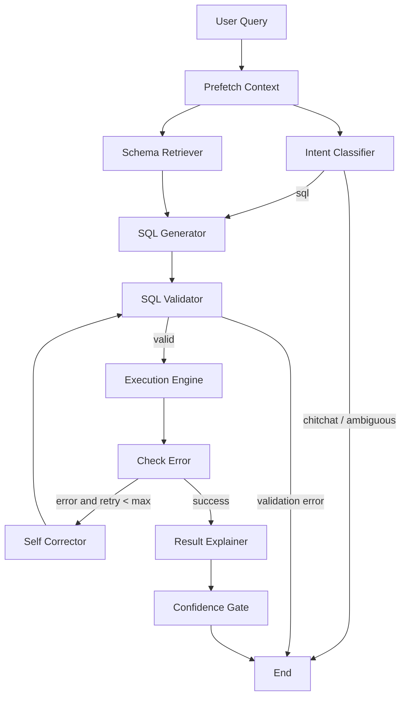

# Agentic SQL Analyst

Production-grade natural-language-to-SQL service built on FastAPI, LangGraph, SQLAlchemy, ChromaDB, and Gemini. This version keeps the original agentic architecture, but upgrades it with latency engineering, model routing, cost tracking, guardrails, confidence scoring, caching, and an evaluation harness.

## Visuals

Architecture diagram:




## What Changed

### Before

- Sequential intent classification and schema retrieval.
- No query-result cache.
- No token accounting or cost visibility.
- No model routing between fast and strong Gemini tiers.
- No request-level latency breakdown.
- No offline evaluation dataset or CLI.
- Basic SQL safety only.

### After

- Parallel prefetch node runs intent classification and schema retrieval concurrently.
- Cache layer supports Redis with in-memory fallback for schema retrieval, embeddings, and successful query results.
- Gemini Flash vs Gemini Pro routing based on stage, complexity, and retry path.
- Per-request latency breakdown, token usage, model usage, and estimated cost.
- Real-schema validation catches hallucinated columns before execution.
- Confidence scoring gates weak answers with a safe fallback.
- Prompt-injection sanitization and output filtering reduce unsafe prompt and schema leakage behavior.
- Offline evaluation harness runs 40 natural-language queries and reports success, retry rate, latency, cost, and failures.

## Measured Demo Results

Offline evaluation run from `python evaluate.py`:

```json
{
  "total_queries": 40,
  "success_rate_percent": 97.5,
  "retry_rate_percent": 2.5,
  "average_latency_ms": 93.05,
  "average_cost_usd": 0.0003739,
  "failure_cases": [
    {
      "id": "q38",
      "query": "Show refund rate by payment method.",
      "intent": "sql",
      "error": "Query references table 'payments' which is not in the retrieved schema context.",
      "confidence_score": 0.54
    }
  ]
}
```

Sample production-style request telemetry for a multi-table query:

```json
{
  "intent": "sql",
  "retries": 0,
  "latency_breakdown": {
    "intent": 5,
    "schema": 4,
    "llm_sql": 12,
    "validation": 2,
    "execution": 2
  },
  "total_latency_ms": 25,
  "models_used": {
    "intent": "gemini-2.5-flash",
    "sql_generation": "gemini-2.5-pro"
  },
  "token_usage": {
    "prompt_tokens": 404,
    "completion_tokens": 71,
    "total_tokens": 475
  },
  "total_cost_usd": 0.001223,
  "confidence_score": 0.93
}
```

Sample retry path showing Flash on first pass, Pro on correction, and a timeout-aware execution stage:

```json
{
  "retries": 1,
  "latency_breakdown": {
    "intent": 5,
    "schema": 3,
    "llm_sql": 24,
    "validation": 0,
    "execution": 3001
  },
  "models_used": {
    "intent": "gemini-2.5-flash",
    "sql_generation": "gemini-2.5-flash",
    "sql_correction": "gemini-2.5-pro"
  },
  "total_cost_usd": 0.001114
}
```

Sample cached repeat request:

```json
{
  "cache_hits": {
    "query_result": true,
    "schema": false
  },
  "latency_breakdown": {
    "query_cache": 1
  },
  "total_latency_ms": 1
}
```

## Architecture

```text
User Query
   |
   v
Prefetch Context (parallel)
   |-- Intent Classifier
   |-- Schema Retriever
   |
   v
SQL Generator
   |
   v
SQL Validator
   |
   v
Execution Engine
   |
   v
Check Error ---> Self Corrector ---> SQL Validator
   |
   v
Result Explainer
   |
   v
Confidence Gate + Final Answer
```



## Repository Layout

```text
agentic-sql-analyst/
├── app/
│   ├── agent/                  # Existing LangGraph workflow and nodes
│   ├── agents/                 # Runtime/container wiring
│   ├── api/                    # FastAPI routes
│   ├── db/                     # SQLAlchemy connection and schema indexing
│   ├── embeddings/             # Vector-store wrapper
│   ├── evaluation/             # Evaluation runner
│   ├── safety/                 # SQL safety validator
│   ├── services/               # LLM, cache, schema-catalog services
│   ├── utils/                  # Guardrails, metrics, complexity, confidence
│   ├── config.py
│   └── main.py
├── docs/assets/
├── evaluation/queries.json
├── scripts/index_schema.py
├── tests/
├── Dockerfile
├── docker-compose.yml
├── evaluate.py
├── requirements.txt
└── README.md
```

## Upgrade Highlights

### Latency Engineering

- `PrefetchContextNode` runs intent classification and schema retrieval concurrently.
- `CacheService` supports Redis or an in-memory fallback.
- Cached layers:
  - schema retrieval results
  - embeddings
  - previous successful query results
- Every request records:
  - `intent`
  - `schema`
  - `llm_sql`
  - `validation`
  - `execution`
  - `total_latency_ms`

### Cost Awareness + Model Routing

- `GeminiLLMService` tracks prompt tokens, completion tokens, total tokens, selected model, and estimated USD cost.
- `gemini-2.5-flash` is used for:
  - intent classification
  - low-complexity SQL generation
- `gemini-2.5-pro` is used for:
  - higher-complexity SQL generation
  - retry/self-correction flows

### Failure Intelligence

- Actual-schema validation uses `SchemaCatalogService` so hallucinated tables and columns are caught before execution.
- `compute_confidence` scores requests from schema alignment, retry path, execution outcome, and routed model quality.
- Low-confidence SQL answers return:

```text
I'm not fully confident in this answer. Please refine your query.
```

### Guardrails

- Prompt-injection stripping removes instructions like `ignore previous instructions` and `drop all tables`.
- System prompt and user prompt are separated in the Gemini service.
- Final answers are filtered to avoid leaking raw schema context.

### Real-World Constraints

- Query timeout defaults to 3 seconds.
- Pagination defaults to 50 rows max.
- Large results are summarized in the final answer instead of blindly dumping everything.

## API Contract

`POST /query`

Request:

```json
{
  "query": "Compare revenue by category and order status",
  "session_id": "demo-session-001",
  "page": 1,
  "page_size": 50
}
```

Response:

```json
{
  "answer": "Found 13 records. I’m summarizing the result instead of dumping the full dataset. A representative row looks like name=Books, status=completed, revenue=85.75. SQL used: ...",
  "sql": "SELECT c.name, o.status, SUM(oi.quantity * oi.unit_price) AS revenue ...",
  "rows": [],
  "row_count": 13,
  "execution_time_ms": 2,
  "retries": 0,
  "intent": "sql",
  "total_latency_ms": 25,
  "latency_breakdown": {
    "intent": 5,
    "schema": 4,
    "llm_sql": 12,
    "validation": 2,
    "execution": 2
  },
  "prompt_tokens": 404,
  "completion_tokens": 71,
  "total_tokens": 475,
  "total_cost_usd": 0.001223,
  "confidence_score": 0.93,
  "models_used": {
    "intent": "gemini-2.5-flash",
    "sql_generation": "gemini-2.5-pro"
  },
  "cache_hits": {
    "query_result": false,
    "schema": false
  }
}
```

`GET /health`

Returns service and database status.

## Setup

1. Create and activate a Python 3.11+ environment.
2. Install dependencies:

```bash
pip install -r requirements.txt
```

3. Create a `.env` file:

```env
DATABASE_URL=sqlite+aiosqlite:///./agentic_sql_analyst.db
GEMINI_API_KEY=your-gemini-api-key
REDIS_URL=redis://localhost:6379/0
VECTOR_DB_PATH=./chroma_db
MAX_RETRIES=3
MAX_ROWS=50
TOP_K_TABLES=3
GEMINI_FLASH_MODEL=gemini-2.5-flash
GEMINI_PRO_MODEL=gemini-2.5-pro
EMBED_MODEL=all-MiniLM-L6-v2
QUERY_TIMEOUT_SECONDS=3
CONFIDENCE_THRESHOLD=0.6
```

4. Initialize the local sample database:

```bash
sqlite3 agentic_sql_analyst.db < tests/fixtures/sample_schema.sql
```

5. Index schema documents:

```bash
python scripts/index_schema.py
```

6. Start the API:

```bash
uvicorn app.main:app --reload
```

7. Run tests:

```bash
pytest
```

8. Run the evaluation suite:

```bash
python evaluate.py
```

## Docker

Start the API and seeded PostgreSQL instance:

```bash
docker compose up --build
```

The sample schema is mounted from `tests/fixtures/sample_schema.sql`, and Chroma data persists under `./chroma_db`.

## Evaluation

The evaluation framework includes:

- 40 natural-language benchmark queries
- deterministic demo mode for CI and local validation
- success rate
- retry rate
- average latency
- average cost
- explicit failure case reporting

Run it with:

```bash
python evaluate.py
```

Or limit the sample size:

```bash
python evaluate.py --limit 10
```

## Production Notes

- The service stays within the original LangGraph architecture and upgrades it incrementally.
- Redis is optional; the in-memory cache path keeps local development simple.
- The confidence gate intentionally favors safe abstention over low-confidence SQL answers.
- Query-result caching is request-text based, so production deployments should pair it with schema-versioning or invalidation when data freshness matters.

## Included Assets

- `docs/assets/agentic_sql_analyst_architecture.svg`
- `docs/assets/repo_reference_screenshot.png`
